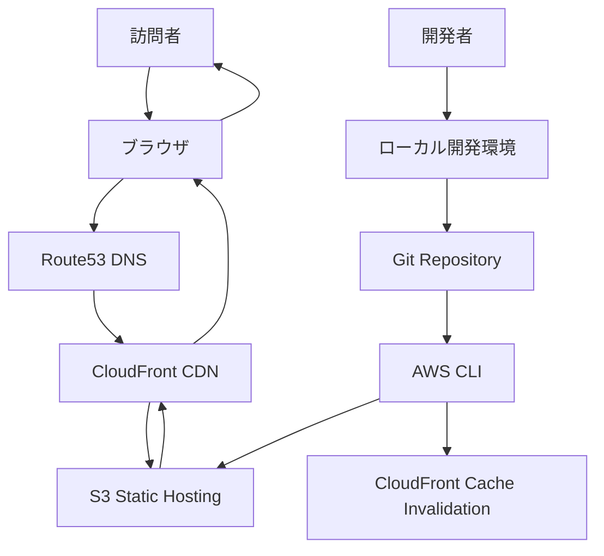
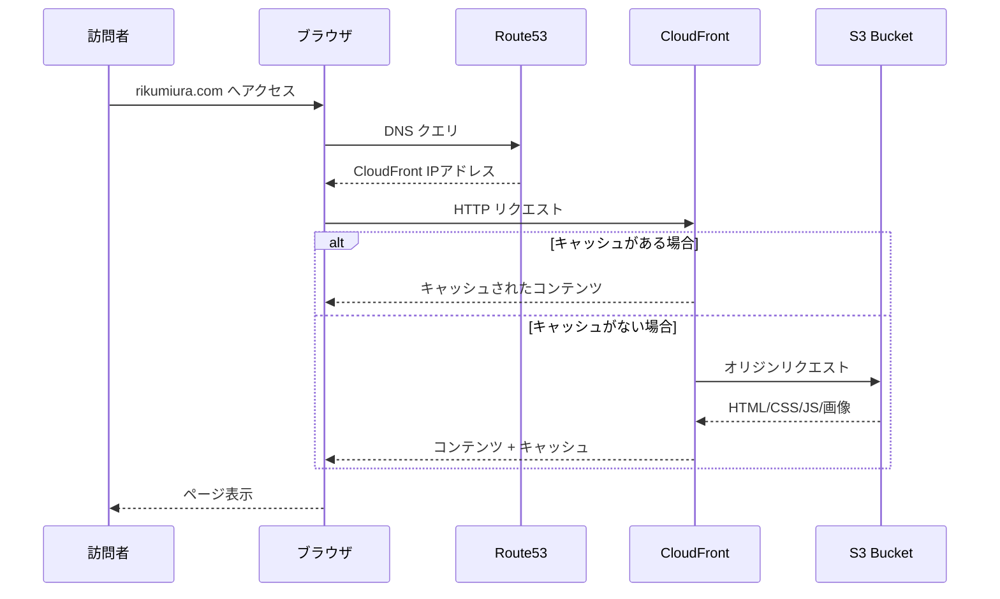
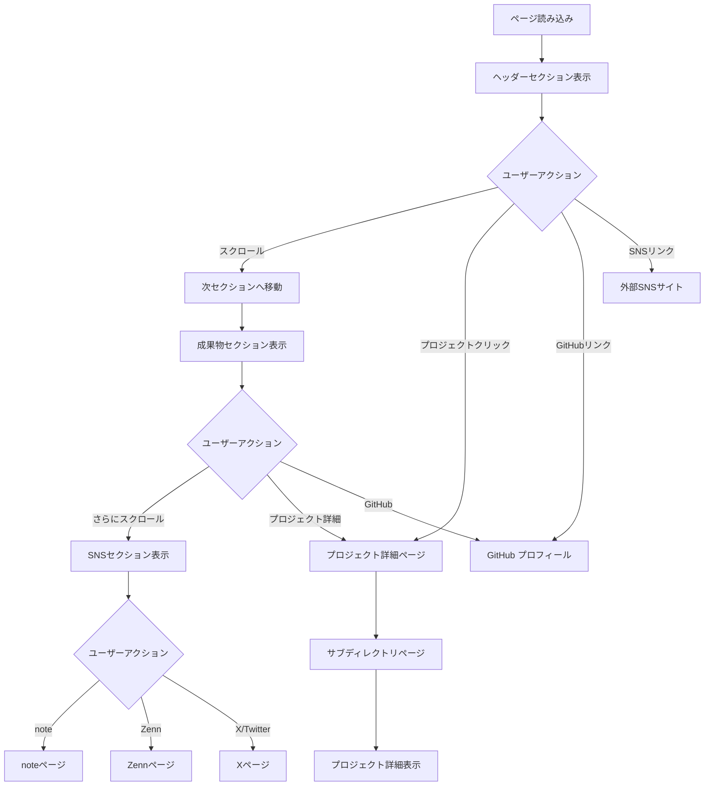
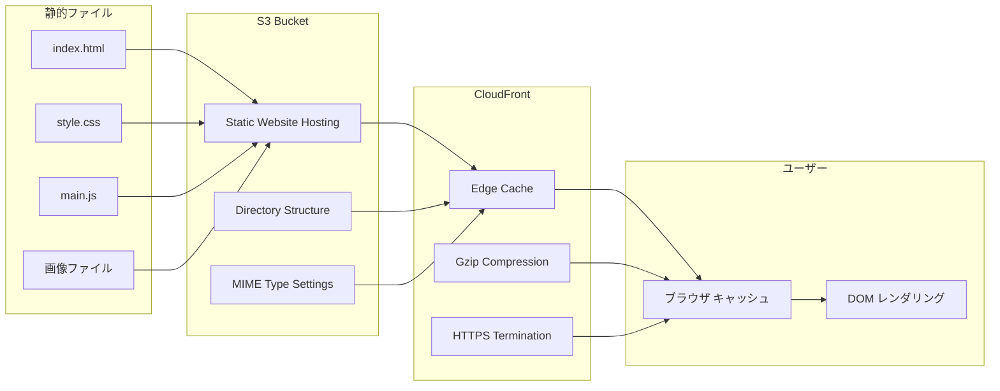
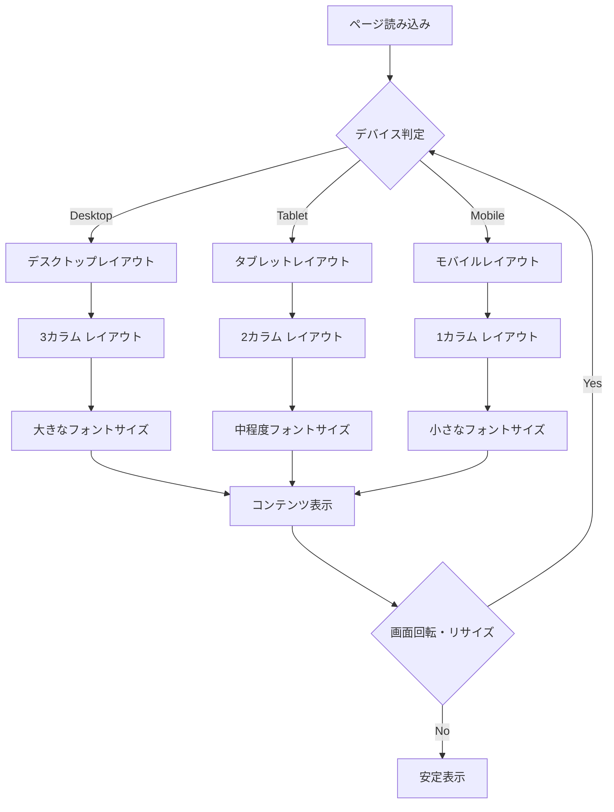
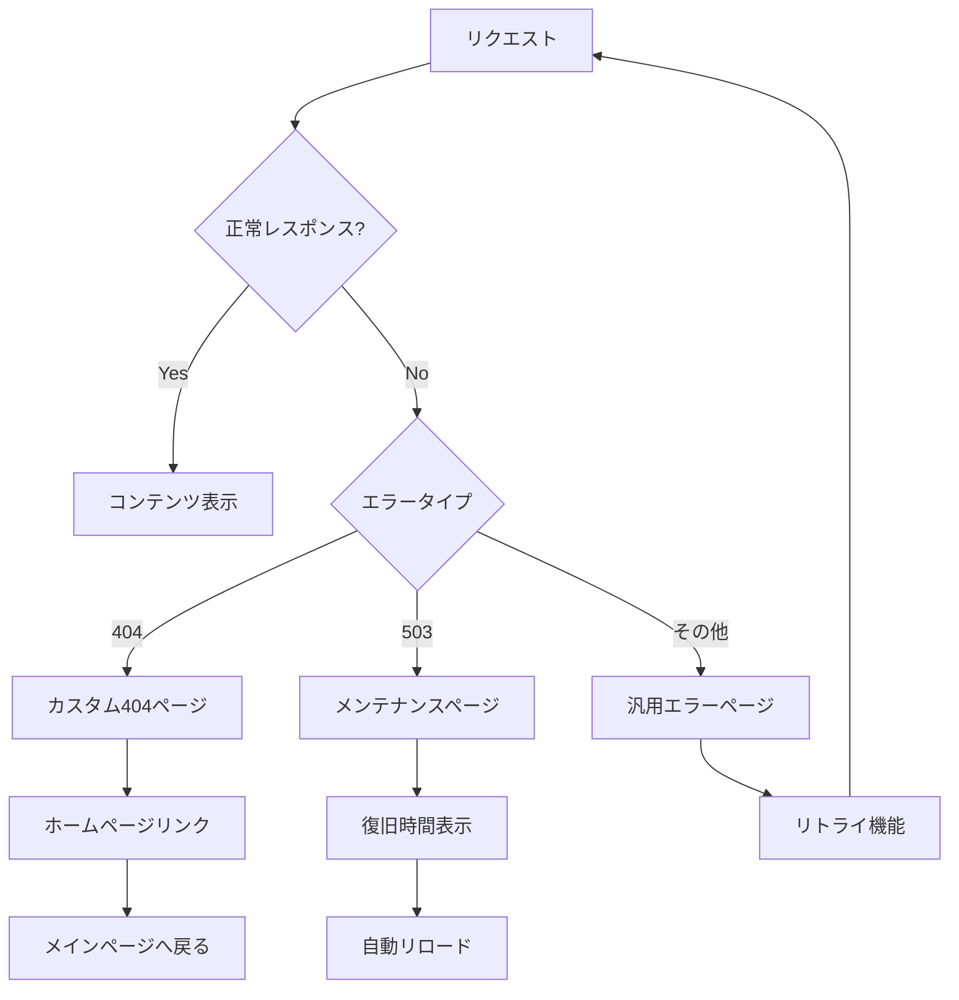
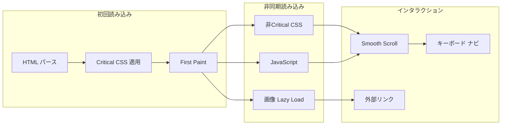
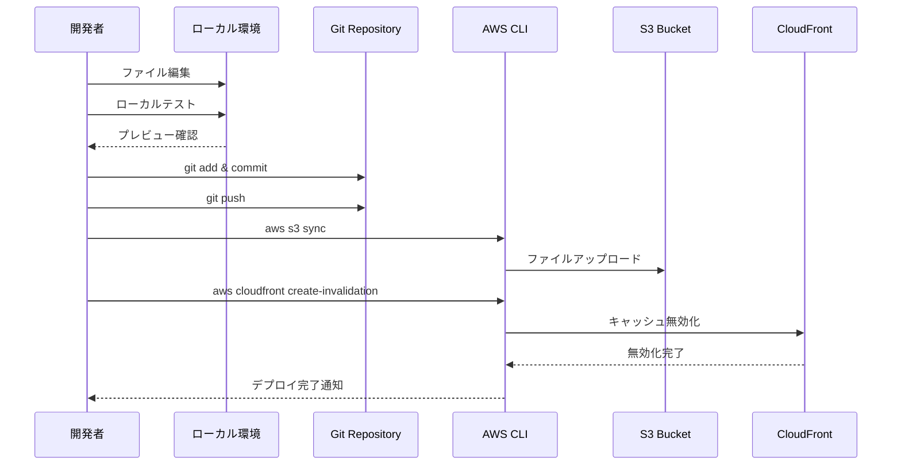

# プロフィールページ データフロー図

## システム全体のデータフロー

```mermaid
flowchart TD
    A[訪問者] --> B[ブラウザ]
    B --> C[Route53 DNS]
    C --> D[CloudFront CDN]
    D --> E[S3 Static Hosting]
    E --> D
    D --> B
    B --> A

    F[開発者] --> G[ローカル開発環境]
    G --> H[Git Repository]
    H --> I[AWS CLI]
    I --> E
    I --> J[CloudFront Cache Invalidation]
```

## ユーザーアクセスフロー

```mermaid
sequenceDiagram
    participant U as 訪問者
    participant B as ブラウザ
    participant R as Route53
    participant CF as CloudFront
    participant S3 as S3 Bucket
    
    U->>B: rikumiura.com へアクセス
    B->>R: DNS クエリ
    R-->>B: CloudFront IPアドレス
    B->>CF: HTTP リクエスト
    
    alt キャッシュがある場合
        CF-->>B: キャッシュされたコンテンツ
    else キャッシュがない場合
        CF->>S3: オリジンリクエスト
        S3-->>CF: HTML/CSS/JS/画像
        CF-->>B: コンテンツ + キャッシュ
    end
    
    B-->>U: ページ表示
```

## ユーザーインタラクションフロー

```mermaid
flowchart TD
    A[ページ読み込み] --> B[ヘッダーセクション表示]
    B --> C{ユーザーアクション}
    
    C -->|スクロール| D[次セクションへ移動]
    C -->|プロジェクトクリック| E[プロジェクト詳細ページ]
    C -->|GitHubリンク| F[GitHub プロフィール]
    C -->|SNSリンク| G[外部SNSサイト]
    
    D --> H[成果物セクション表示]
    H --> I{ユーザーアクション}
    
    I -->|さらにスクロール| J[SNSセクション表示]
    I -->|プロジェクト詳細| E
    I -->|GitHub| F
    
    J --> K{ユーザーアクション}
    K -->|note| L[noteページ]
    K -->|Zenn| M[Zennページ]
    K -->|X/Twitter| N[Xページ]
    
    E --> O[サブディレクトリページ]
    O --> P[プロジェクト詳細表示]
```

## コンテンツ配信フロー

```mermaid
flowchart LR
    subgraph "静的ファイル"
        A[index.html]
        B[style.css]
        C[main.js]
        D[画像ファイル]
    end
    
    subgraph "S3 Bucket"
        E[Static Website Hosting]
        F[Directory Structure]
        G[MIME Type Settings]
    end
    
    subgraph "CloudFront"
        H[Edge Cache]
        I[Gzip Compression]
        J[HTTPS Termination]
    end
    
    subgraph "ユーザー"
        K[ブラウザ キャッシュ]
        L[DOM レンダリング]
    end
    
    A --> E
    B --> E  
    C --> E
    D --> E
    
    E --> H
    F --> H
    G --> H
    
    H --> K
    I --> K
    J --> K
    
    K --> L
```

## レスポンシブ表示フロー

```mermaid
flowchart TD
    A[ページ読み込み] --> B{デバイス判定}
    
    B -->|Desktop| C[デスクトップレイアウト]
    B -->|Tablet| D[タブレットレイアウト]  
    B -->|Mobile| E[モバイルレイアウト]
    
    C --> F[3カラム レイアウト]
    D --> G[2カラム レイアウト]
    E --> H[1カラム レイアウト]
    
    F --> I[大きなフォントサイズ]
    G --> J[中程度フォントサイズ]
    H --> K[小さなフォントサイズ]
    
    I --> L[コンテンツ表示]
    J --> L
    K --> L
    
    L --> M{画面回転・リサイズ}
    M -->|Yes| B
    M -->|No| N[安定表示]
```

## エラーハンドリングフロー

```mermaid
flowchart TD
    A[リクエスト] --> B{正常レスポンス?}
    
    B -->|Yes| C[コンテンツ表示]
    B -->|No| D{エラータイプ}
    
    D -->|404| E[カスタム404ページ]
    D -->|503| F[メンテナンスページ]
    D -->|その他| G[汎用エラーページ]
    
    E --> H[ホームページリンク]
    F --> I[復旧時間表示]
    G --> J[リトライ機能]
    
    H --> K[メインページへ戻る]
    I --> L[自動リロード]
    J --> A
```

## パフォーマンス最適化フロー

```mermaid
flowchart LR
    subgraph "初回読み込み"
        A[HTML パース]
        B[Critical CSS 適用]
        C[First Paint]
    end
    
    subgraph "非同期読み込み"
        D[非Critical CSS]
        E[JavaScript]
        F[画像 Lazy Load]
    end
    
    subgraph "インタラクション"
        G[Smooth Scroll]
        H[外部リンク]
        I[キーボード ナビ]
    end
    
    A --> B --> C
    C --> D
    C --> E  
    C --> F
    
    D --> G
    E --> G
    F --> H
    G --> I
```

## デプロイフロー

```mermaid
sequenceDiagram
    participant Dev as 開発者
    participant Local as ローカル環境
    participant Git as Git Repository
    participant AWS as AWS CLI
    participant S3 as S3 Bucket
    participant CF as CloudFront
    
    Dev->>Local: ファイル編集
    Dev->>Local: ローカルテスト
    Local-->>Dev: プレビュー確認
    
    Dev->>Git: git add & commit
    Dev->>Git: git push
    
    Dev->>AWS: aws s3 sync
    AWS->>S3: ファイルアップロード
    
    Dev->>AWS: aws cloudfront create-invalidation
    AWS->>CF: キャッシュ無効化
    CF-->>AWS: 無効化完了
    
    AWS-->>Dev: デプロイ完了通知
```