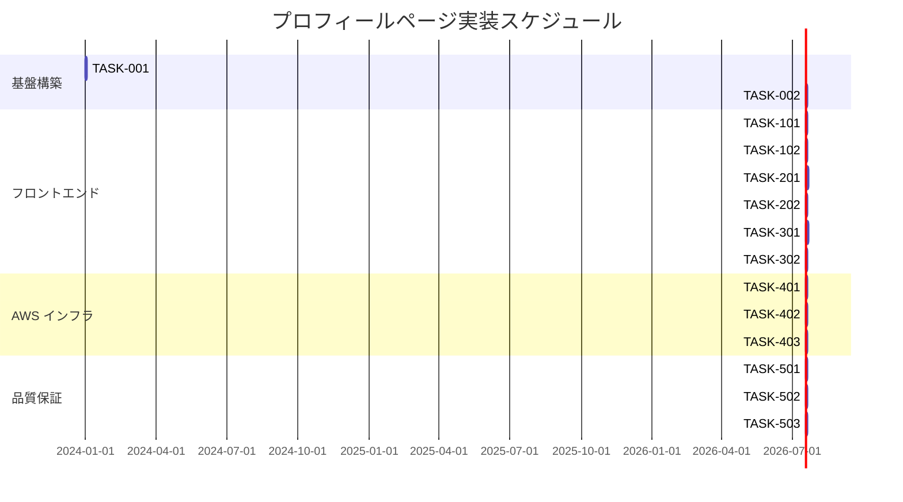

# プロフィールページ 実装タスク

## 概要

**全タスク数**: 15  
**推定作業時間**: 32-40時間  
**クリティカルパス**: TASK-001 → TASK-002 → TASK-101 → TASK-201 → TASK-301 → TASK-401

## タスク一覧

### フェーズ1: プロジェクト基盤構築

#### TASK-001: プロジェクト構造セットアップ

- [x] **タスク完了**
- **タスクタイプ**: DIRECT
- **要件リンク**: アーキテクチャ設計 - ファイル構成
- **依存タスク**: なし
- **実装詳細**:
  - プロジェクトディレクトリ構造の作成
  - package.json の初期設定
  - .gitignore の更新（フロントエンド対応）
  - README.md の作成
- **完了条件**:
  - [x] 推奨ディレクトリ構造が作成されている
  - [x] package.json が適切に設定されている
  - [x] 開発用スクリプトが動作する

#### TASK-002: 開発環境構築

- [x] **タスク完了**
- **タスクタイプ**: DIRECT
- **要件リンク**: アーキテクチャ設計 - 技術選定
- **依存タスク**: TASK-001
- **実装詳細**:
  - 開発サーバーの設定（Live Server等）
  - CSS/JS ビルドツールの設定（Vite/Parcel）
  - フォント読み込み設定（Inter, Noto Sans JP）
  - 画像最適化ツールの設定
- **テスト要件**:
  - [x] ローカル開発サーバーが起動する
  - [x] ホットリロードが動作する
  - [x] フォントが正しく読み込まれる
- **完了条件**:
  - [x] 開発環境が正常に動作している
  - [x] ビルドプロセスが設定されている

### フェーズ2: フロントエンド実装

#### TASK-101: HTML構造実装

- [ ] **タスク完了**
- **タスクタイプ**: TDD
- **要件リンク**: REQUIREMENT.md - ページ構造、アーキテクチャ設計 - セマンティックマークアップ
- **依存タスク**: TASK-002
- **実装詳細**:
  - セマンティックなHTML5構造の実装
  - メタデータ設定（SEO対応）
  - セクション構成（ヘッダー、成果物、SNS）
  - アクセシビリティ属性の実装
- **テスト要件**:
  - [ ] HTML バリデーション通過
  - [ ] セマンティック構造の確認
  - [ ] アクセシビリティテスト（基本項目）
- **UI/UX要件**:
  - [ ] アクセシビリティ: ARIA属性、見出し階層
  - [ ] SEO: メタタグ、構造化データ
- **完了条件**:
  - [ ] HTML5バリデーション通過
  - [ ] 全セクションが適切にマークアップされている
  - [ ] アクセシビリティ基準をクリア

#### TASK-102: ベースCSS実装

- [ ] **タスク完了**
- **タスクタイプ**: TDD
- **要件リンク**: アーキテクチャ設計 - デザインシステム
- **依存タスク**: TASK-101
- **実装詳細**:
  - CSS変数によるデザインシステム
  - ノーマライズCSS適用
  - タイポグラフィシステム
  - カラーパレット定義
- **テスト要件**:
  - [ ] CSS バリデーション通過
  - [ ] ブラウザ間のスタイル統一確認
  - [ ] フォント読み込み確認
- **UI/UX要件**:
  - [ ] デザイン仕様: ミニマルフラット、白背景・黒文字
  - [ ] タイポグラフィ: Inter(英語)、Noto Sans JP(日本語)
  - [ ] レイアウト: 大きな余白、クリーンな設計
- **完了条件**:
  - [ ] デザインシステムが適用されている
  - [ ] 指定フォントが正しく表示される
  - [ ] ベースレイアウトが完成している

#### TASK-201: レスポンシブレイアウト実装

- [ ] **タスク完了**
- **タスクタイプ**: TDD
- **要件リンク**: アーキテクチャ設計 - レスポンシブ ブレークポイント
- **依存タスク**: TASK-102
- **実装詳細**:
  - モバイルファーストアプローチ
  - フレックスボックス・グリッドレイアウト
  - ブレークポイント設定（768px, 1024px, 1200px）
  - 画像レスポンシブ対応
- **テスト要件**:
  - [ ] 各ブレークポイントでのレイアウト確認
  - [ ] 画像の適切な表示確認
  - [ ] タッチデバイスでの操作確認
- **UI/UX要件**:
  - [ ] モバイル対応: 1カラムレイアウト
  - [ ] タブレット対応: 2カラムレイアウト
  - [ ] デスクトップ対応: 3カラムレイアウト
  - [ ] 画像最適化: 遅延読み込み、WebP対応
- **完了条件**:
  - [ ] 全デバイスで適切にレイアウトされている
  - [ ] 画像が最適化されている
  - [ ] タッチ操作が問題なく動作する

#### TASK-202: セクション別スタイリング

- [ ] **タスク完了**
- **タスクタイプ**: TDD
- **要件リンク**: REQUIREMENT.md - コンテンツ構成
- **依存タスク**: TASK-201
- **実装詳細**:
  - ヘッダーセクションのスタイリング
  - 成果物セクションのカード設計
  - SNSセクションのアイコン配置
  - ナビゲーション要素のスタイリング
- **テスト要件**:
  - [ ] 各セクションの視覚確認
  - [ ] ホバー・フォーカス状態の確認
  - [ ] カードレイアウトのグリッド確認
- **UI/UX要件**:
  - [ ] カードデザイン: 影効果、ホバーアニメーション
  - [ ] アイコン: SVG使用、適切なサイズ
  - [ ] 統一感: 余白・フォントサイズの統一
- **完了条件**:
  - [ ] 全セクションが仕様通りにスタイリングされている
  - [ ] インタラクティブ要素が適切に動作する

#### TASK-301: JavaScript インタラクション実装

- [ ] **タスク完了**
- **タスクタイプ**: TDD
- **要件リンク**: アーキテクチャ設計 - JavaScript機能
- **依存タスク**: TASK-202
- **実装詳細**:
  - スムーススクロール機能
  - セクション間ナビゲーション
  - 外部リンク処理
  - パフォーマンス監視コード
- **テスト要件**:
  - [ ] スクロール動作の確認
  - [ ] ナビゲーション機能の確認
  - [ ] 外部リンクの動作確認
  - [ ] エラーハンドリング確認
- **UI/UX要件**:
  - [ ] スムーススクロール: イージング適用
  - [ ] ナビゲーション: セクション自動ハイライト
  - [ ] 外部リンク: 新しいタブで開く
  - [ ] アクセシビリティ: キーボード操作対応
- **完了条件**:
  - [ ] 全インタラクションが適切に動作する
  - [ ] パフォーマンスに問題がない
  - [ ] エラー処理が適切に実装されている

#### TASK-302: パフォーマンス最適化

- [ ] **タスク完了**
- **タスクタイプ**: TDD
- **要件リンク**: アーキテクチャ設計 - パフォーマンス設計
- **依存タスク**: TASK-301
- **実装詳細**:
  - 画像最適化・遅延読み込み
  - CSS・JavaScript の最小化
  - クリティカルCSS の特定・インライン化
  - フォント最適化（font-display: swap）
- **テスト要件**:
  - [ ] Core Web Vitals計測
  - [ ] 画像読み込み確認
  - [ ] JavaScript実行時間計測
  - [ ] ネットワーク通信量確認
- **UI/UX要件**:
  - [ ] ローディング状態: プレースホルダー表示
  - [ ] 遅延読み込み: スクロール連動
  - [ ] フォント読み込み: FOUT対策
- **パフォーマンス目標**:
  - [ ] First Contentful Paint < 1.5秒
  - [ ] Largest Contentful Paint < 2.5秒
  - [ ] Cumulative Layout Shift < 0.1
- **完了条件**:
  - [ ] パフォーマンス目標を達成している
  - [ ] 全最適化が適用されている

### フェーズ3: AWS インフラ構築

#### TASK-401: S3 静的ホスティング設定

- [ ] **タスク完了**
- **タスクタイプ**: DIRECT
- **要件リンク**: アーキテクチャ設計 - AWS構成
- **依存タスク**: TASK-302
- **実装詳細**:
  - S3バケット作成・設定
  - 静的ウェブサイトホスティング有効化
  - バケットポリシー設定
  - ファイルアップロード・同期設定
- **テスト要件**:
  - [ ] S3エンドポイントでのアクセス確認
  - [ ] ファイル同期動作確認
  - [ ] 権限設定確認
- **完了条件**:
  - [ ] S3でサイトが表示される
  - [ ] デプロイフローが動作する

#### TASK-402: CloudFront CDN設定

- [ ] **タスク完了**
- **タスクタイプ**: DIRECT
- **要件リンク**: アーキテクチャ設計 - CloudFront設定
- **依存タスク**: TASK-401
- **実装詳細**:
  - CloudFrontディストリビューション作成
  - キャッシュ設定・動作設定
  - SSL証明書設定（HTTPS化）
  - エラーページ設定
- **テスト要件**:
  - [ ] HTTPS アクセス確認
  - [ ] キャッシュ動作確認
  - [ ] エラーページ表示確認
  - [ ] 世界各地からのアクセス速度確認
- **完了条件**:
  - [ ] HTTPS でアクセス可能
  - [ ] キャッシュが適切に動作している
  - [ ] エラーハンドリングが機能している

#### TASK-403: Route53 DNS設定

- [ ] **タスク完了**
- **タスクタイプ**: DIRECT
- **要件リンク**: アーキテクチャ設計 - Route53設定
- **依存タスク**: TASK-402
- **実装詳細**:
  - ホストゾーン設定
  - Aレコード・CNAMEレコード設定
  - ドメインとCloudFrontの紐付け
  - ヘルスチェック設定
- **テスト要件**:
  - [ ] ドメインアクセス確認
  - [ ] DNS伝播確認
  - [ ] SSL証明書有効性確認
  - [ ] リダイレクト動作確認
- **完了条件**:
  - [ ] rikumiura.com でアクセス可能
  - [ ] DNS設定が適切に動作している

### フェーズ4: 品質保証・運用準備

#### TASK-501: E2Eテスト実装

- [ ] **タスク完了**
- **タスクタイプ**: TDD
- **要件リンク**: 全要件
- **依存タスク**: TASK-403
- **実装詳細**:
  - Playwright/Cypress セットアップ
  - 主要ユーザーフローのテスト
  - デバイス別テスト
  - パフォーマンステスト自動化
- **テスト要件**:
  - [ ] ページ読み込みテスト
  - [ ] スクロール・ナビゲーションテスト
  - [ ] 外部リンククリックテスト
  - [ ] レスポンシブ表示テスト
  - [ ] アクセシビリティテスト
- **完了条件**:
  - [ ] 全主要フローが自動テストされている
  - [ ] CI/CDパイプラインに組み込まれている

#### TASK-502: デプロイ自動化

- [ ] **タスク完了**
- **タスクタイプ**: DIRECT
- **要件リンク**: アーキテクチャ設計 - 運用・保守設計
- **依存タスク**: TASK-501
- **実装詳細**:
  - GitHub Actions / AWS CLI 設定
  - ビルド→S3同期→CloudFront無効化の自動化
  - 環境別デプロイ設定
  - ロールバック機能
- **テスト要件**:
  - [ ] 自動デプロイ動作確認
  - [ ] 失敗時のロールバック確認
  - [ ] 通知機能確認
- **完了条件**:
  - [ ] git push で自動デプロイされる
  - [ ] エラー時の通知・復旧が機能している

#### TASK-503: 監視・アナリティクス設定

- [ ] **タスク完了**
- **タスクタイプ**: DIRECT
- **要件リンク**: アーキテクチャ設計 - 監視
- **依存タスク**: TASK-502
- **実装詳細**:
  - CloudWatch アラーム設定
  - Route53 ヘルスチェック
  - 基本的なアナリティクス実装
  - エラー監視・通知設定
- **テスト要件**:
  - [ ] 監視アラーム動作確認
  - [ ] ヘルスチェック動作確認
  - [ ] アナリティクス データ収集確認
- **完了条件**:
  - [ ] サイト監視が正常に動作している
  - [ ] 必要な通知が設定されている

## 実行順序

## マイルストーン

### マイルストーン1: 基盤完了（Day 2）
- [ ] プロジェクト構造と開発環境が整備されている
- [ ] ローカル開発が可能な状態

### マイルストーン2: フロントエンド完了（Day 17）
- [ ] デザイン仕様に沿ったページが完成している
- [ ] レスポンシブ対応とインタラクションが実装されている
- [ ] パフォーマンス目標を達成している

### マイルストーン3: インフラ完了（Day 20）
- [ ] AWS上でサイトが公開されている
- [ ] 独自ドメインでアクセス可能

### マイルストーン4: 本番リリース（Day 24）
- [ ] 全テストが通過している
- [ ] 監視・デプロイ自動化が完了している
- [ ] 本番運用が開始可能な状態

## 並行実行可能タスク

- **フェーズ2**: TASK-101とTASK-102は部分的に並行実行可能
- **フェーズ3**: AWS設定タスクは前タスク完了後すぐに開始可能
- **フェーズ4**: テスト実装とデプロイ設定は部分的に並行実行可能

## 完了チェックリスト

### 全体完了条件
- [ ] すべてのタスクが完了している
- [ ] Core Web Vitals が目標値を達成している
- [ ] E2Eテストが全て通過している
- [ ] rikumiura.com でサイトが表示される
- [ ] モバイル・デスクトップ両対応が完璧
- [ ] デプロイ自動化が動作している
- [ ] 監視・アラートが設定されている